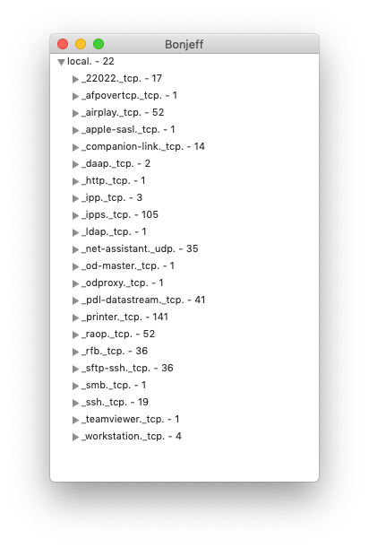

# Bonjeff

Bonjeff is a Mac app that shows you a live display of the Bonjour services published on your network. Bonjeff is intended as a replacement for the discontinued Bonjour Browser app by Tildesoft. Bonjour Browser predated Gatekeeper and thus is not code signed with a Developer ID certificate or notarized by Apple. Bonjeff is validly code signed and notarized, which allows it to be installed on Macs protected by Gatekeeper.



## Installing

1. Download the [latest release](https://github.com/lapcat/Bonjeff/releases/latest).
2. Unzip the downloaded `.zip` file.
3. Move `Bonjeff.app` to your Applications folder.

## Uninstalling

1. Move `Bonjeff.app` to the Trash.

### Building

The Bonjeff Xcode project is configured to code sign the app. For code signing, you need a valid Mac Developer code signing certificate in your keychain, and you need to specify your Apple Developer Program TeamID in the build settings. Create a new file `DEVELOPMENT_TEAM.xcconfig` in the project folder (the same folder as [Shared.xcconfig](Shared.xcconfig)) and add the following build setting to the file:
```
DEVELOPMENT_TEAM = [Your TeamID]
```
The `DEVELOPMENT_TEAM.xcconfig` file should not be added to any git commit. The [.gitignore](.gitignore) file will prevent it from getting committed to the repository.

## Author

[Jeff Johnson](https://lapcatsoftware.com/)

To support the author, you can [PayPal.Me](https://www.paypal.me/JeffJohnsonWI) or buy the Safari extension StopTheMadness in the [Mac App Store](https://apps.apple.com/app/stopthemadness/id1376402589?mt=12).

## Copyright

Bonjeff is Copyright © 2017 Jeff Johnson. All rights reserved.

## License

See the [LICENSE.txt](LICENSE.txt) file for details.
